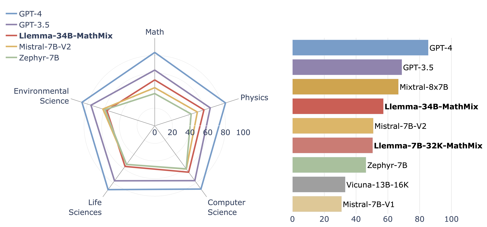

# *Language Models as Science Tutors*

This is the official repository for [*Language Models as Science Tutors*](https://arxiv.org/abs/2402.11111). 


## TutorEval


<br>
<p align="center">

</p>
<br>

### 🎓 About
TutorEval is a question-answering benchmark which evaluates how well a language model (the *LM tutor*) can help a user understand a chapter from a science textbook. TutorEval contains over 800 questions written by 17 expert researchers covering math, computer science, physics, life sciences, and environmental science. TutorEval questions relate to chapters from [TutorChat](https://huggingface.co/datasets/princeton-nlp/TutorChat) (downloaded from [libretexts.org](https://libretexts.org)) and require the model to answer free-form questions written from the point of view of a student. TutorEval questions are very diverse: they may ask for explanations of complicated content, for additional information going beyond the chapter, for verifications of exercise solutions, etc. Download the TutorEval data from HuggingFace at [princeton-nlp/TutorEval](https://huggingface.co/datasets/princeton-nlp/TutorEval).

TutorEval uses an LM as an evaluator. Once the LM tutor has generated responses to TutorEval questions, the evaluator is prompted to compare the tutor's outputs with a set of ground-truth *key points*. These key points were written by the human experts who created TutorEval, and sketch the most important points that the tutor should cover when answering the student.

### 📖 OpenBook and 📕 ClosedBook

TutorEval questions are very diverse and rely on the textbook chapter in different ways. Some questions explicitly refer to the chapter (*open-book*), and some questions are phrased in such a way that they can be understood without reading the textbook chapter (*closed-book*). This means that TutorEval contains two evaluations in one:

- 📖 TutorEval with open-book evaluation: this is our main setting and uses all 834 TutorEval questions. The LM tutor is prompted with the entire textbook chapter and the question. This requires LMs to process contexts up to 6,000 words.
- 📕 TutorEval-ClosedBook: this evaluation uses the 370 closed-book questions in TutorEval and prompts the LM tutor without the chapter. This makes it possible to evaluate short-context LMs.

### 🏆 Leaderboard
We rank the models based on the full TutorEval score, even though TutorEval-ClosedBook rankings sometimes differ.
|Model|TutorEval| ClosedBook|
|-|-|-|
| GPT-4 | 85.2 | 86.1 | 
| GPT-3.5-Turbo | 68.3 | 69.6 | 
| Mixtral-8x7B | 66.3 | 68.2 | 
| Llemma-34B-MathMix | 56.8 | 55.3 | 
| Mistral-7B-Instruct-V0.2 | 55.5 | 58.7 | 
| Llemma-7B-32K-MathMix | 50.0 | 45.6 | 
| Zephyr-7B-Beta | 45.7 | 49.4 | 
| Vicuna-13B-V1.5-16K | 32.9 | 36.8 | 
| Mistral-7B-Instruct-V0.1 | 30.5  | 35.5 | 
| Gemma-7B-IT | 24.0 | 39.5 | 
### 🧑‍💻 Evaluating on TutorEval

To evaluate your own model on TutorEval, please use the scripts provided in `./tutoreval`.

- `./tutoreval/generate.py` produces the LM tutor outputs. 
- `./tutoreval/grade.py` uses GPT-4 as an evaluator to grade the LM tutor's outputs. 
- `./tutoreval/get_results.py` collects GPT-4's grades to give a breakdown of the final TutorEval performance.

See `./tutoreval/README.md` for detailed instructions.


### Coming soon:
-  Human and GPT-4 gradings of the models evaluated in the paper


## TutorChat
TutorChat is the first dialogue-tuning dataset for science. TutorChat consists of 80,000 synthetic teacher-student dialogues created using GPT-3.5 and GPT-4. Each conversation is grounded in a textbook chapter downloaded from [libretexts.org](https://libretexts.org) and can take various formats:
- open-book teacher-student dialogues, where the student asks questions about a textbook chapter and the teacher gives helpful answers. These discussions are led by the student.
- closed-book dialogues, where the teacher conducts a class based on the textbook chapter.
- textbook exams, which are question/answer pairs based on the textbook chapter.

We provide TutorChat dialogues for all chapters contained in the TextbookChapters dataset below, which includes humanities and social sciences. 40% of TutorChat dialogues concern STEM subjects.

Download the TutorChat data from HuggingFace at [princeton-nlp/TutorChat](https://huggingface.co/datasets/princeton-nlp/TutorChat). 

### 📚 Textbook chapters 
Download the processed textbook chapters from HuggingFace at [princeton-nlp/TextbookChapters](https://huggingface.co/datasets/princeton-nlp/TextbookChapters). This dataset was obtained by scraping [libretexts.org](https://libretexts.org) and processing the cleaned HTML files with the HTML-to-LaTeX parser from [Openwebmath](https://github.com/keirp/OpenWebMath). 

### ⚙️ TutorChat processing
`./tokenization/tokenize_tutorchat.py` tokenizes TutorChat and creates training labels according to the recipe used to train `Llemma-7B-32K-MathMix`. Use the flag `--stem_only` to tokenize only the STEM split of TutorChat.

### 🔢 MathMix
MathMix is a fine-tuning dataset composed of the STEM split of TutorChat and a processed version of [MetaMath](https://huggingface.co/datasets/meta-math/MetaMathQA). In `./tokenization`, we provide some scripts to re-create and tokenize MathMix.

`./tokenization/tokenize_metamath.py` tokenizes MetaMath by randomly concatenating question/answer pairs to form longer samples. Use the flag `--num_concat` to set the number of samples to concatenate. MathMix concatenates 10 samples at a time. 

`./mathmix_combine.py` concatenates and shuffles the tokenized TutorChat and MetaMath datasets to create MathMix. Use the flags `--tutorchat` and `--metamath` to set the paths to your tokenized datasets created with `./tokenization/tokenize_tutorchat.py` and `./tokenization/tokenize_metamath.py`.

## Models
Download our models from HuggingFace at [princeton-nlp/Llemma-7B-32K-MathMix](https://huggingface.co/princeton-nlp/Llemma-7B-32K-MathMix) and [princeton-nlp/Llemma-34B-MathMix](https://huggingface.co/princeton-nlp/Llemma-34B-MathMix).

## Citation
```bibtex
@misc{chevalier2024language,
      title={Language Models as Science Tutors}, 
      author={Alexis Chevalier and Jiayi Geng and Alexander Wettig and Howard Chen and Sebastian Mizera and Toni Annala and Max Jameson Aragon and Arturo Rodríguez Fanlo and Simon Frieder and Simon Machado and Akshara Prabhakar and Ellie Thieu and Jiachen T. Wang and Zirui Wang and Xindi Wu and Mengzhou Xia and Wenhan Jia and Jiatong Yu and Jun-Jie Zhu and Zhiyong Jason Ren and Sanjeev Arora and Danqi Chen},
      year={2024},
      eprint={2402.11111},
      archivePrefix={arXiv},
      primaryClass={cs.CL}
}
```

